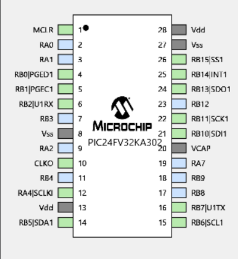

# Light-Sensing Microcontroller
This project involved creating a battery-powered embedded system which uses a photodiode at the beginning of the signal chain. The photodiode produces a current when light is shined on it. We fed this to a transresistance amplifier, outputting a voltage from the amplifier. From there, we used an RC filter circuit to cut off frequencies higher than 100hz. We verified this using LTSpice noise simulations. From there, the RC filter's output is passed to an analog-to-digital converter (ADC). The ADC converts the voltage into 32-bit data words, which are accessed using SPI. To read the data, we configured a PIC microcontroller as the master device, and polled the ADC appropriately. After reading the SPI data, we convert it back to its current repreentation in microamps, and use the I2C protocol to display this on an LCD screen. This repository stores the microcontroller code and configuration used to accomplish this.

The microcontroller used was a Microchip PIC24FV32KA302, and the pinout is shown in   
main.c details the everything that is done (in order) in the comments. This microcontroller was used in combination with a custom built, battery-powered PCB in a 3D printed enclosure.
